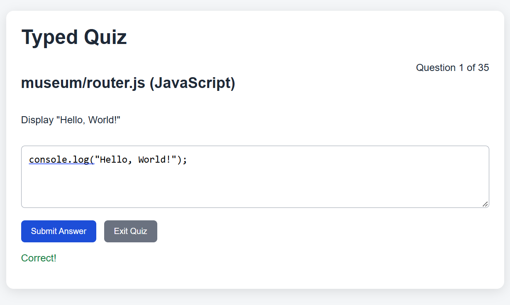
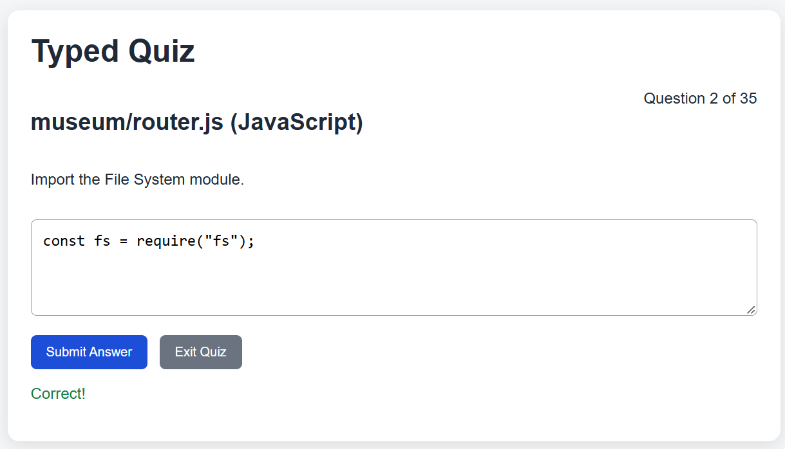
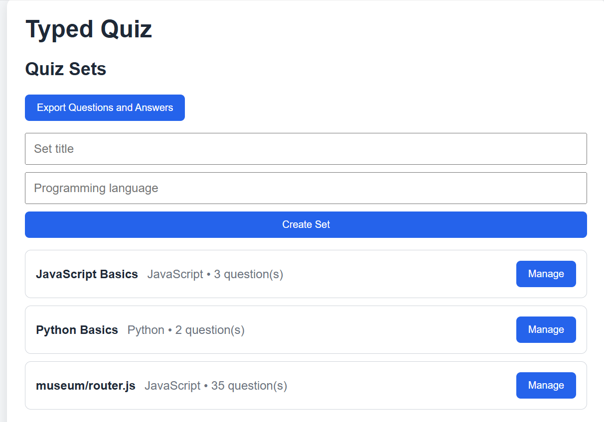
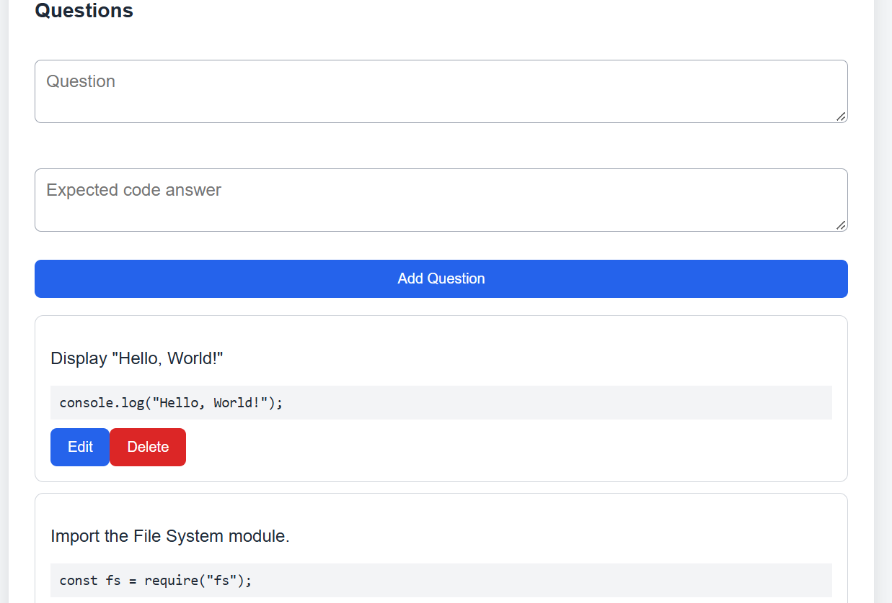
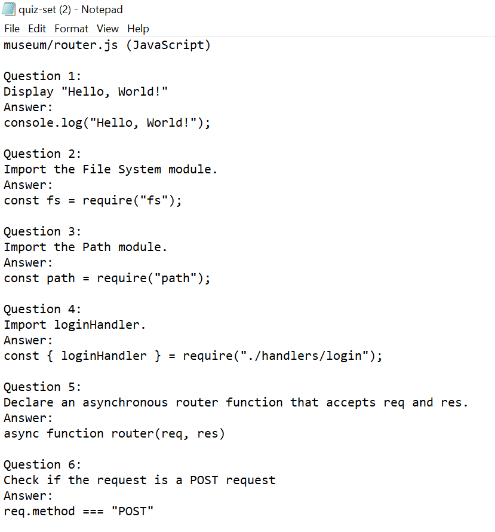

# Typed Quiz App

This app is helpful for learning programming language syntax.

---

## Install Dependencies

In the command terminal, run:

```bash
npm install
```
---

## Start the app:

To run a local instance, run the following in the terminal from the root directory:

```bash
npm start
```

## Screenshots









